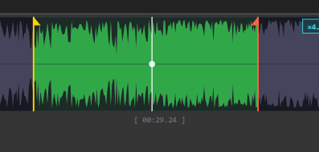

# Afloy Audio Tools

Custom audio nodes for [ComfyUI](https://github.com/comfyanonymous/ComfyUI) — professional audio editing right inside your workflow.



[](#installation)

---

## Quick Start (Afloy Audio Trim)

Use the main node to trim audio directly in your workflow.

1. Add an `Afloy Audio Trim` node and connect `audio`.
2. Drag `start_sec` / `end_sec` markers (or press `Tab` to switch, `I`/`O` to set from the cursor).
3. Drag the white scrub cursor to seek; press `Space` to play/stop.
4. Use `+`/`-` (or mouse wheel) for zoom and `Shift + mouse wheel` for horizontal scroll.

Widget highlights:

- Filled-polygon waveform (classic DAW look)
- Draggable start/end markers with zero-crossing snap
- Draggable scrub cursor — click to place, drag to seek
- Play from cursor position (constrained to selection)
- Region drag — grab inside the selection to move both markers
- Zoom up to 50x via `+`/`-` buttons or mouse wheel
- Horizontal scroll with `Shift + mouse wheel`
- In-node playback with loop toggle
- Hover tooltip showing time under cursor

**Keyboard shortcuts** (when the node is selected):

<table style="border-collapse:collapse;width:100%;table-layout:fixed;margin:8px 0;">
  <thead>
    <tr>
      <th style="border:1px solid #d0d7de;background:#f6f8fa;padding:8px;text-align:left;width:35%;">Key</th>
      <th style="border:1px solid #d0d7de;background:#f6f8fa;padding:8px;text-align:left;">Action</th>
    </tr>
  </thead>
  <tbody>
    <tr>
      <td style="border:1px solid #d0d7de;padding:8px;"><span style="font-family:ui-monospace,SFMono-Regular,Menlo,Monaco,Consolas,monospace;display:block;width:100%;">Space</span></td>
      <td style="border:1px solid #d0d7de;padding:8px;">Play / Stop</td>
    </tr>
    <tr>
      <td style="border:1px solid #d0d7de;padding:8px;"><span style="font-family:ui-monospace,SFMono-Regular,Menlo,Monaco,Consolas,monospace;display:block;width:100%;">Shift + &larr; &rarr;</span></td>
      <td style="border:1px solid #d0d7de;padding:8px;">Nudge active marker by 1 second</td>
    </tr>
    <tr>
      <td style="border:1px solid #d0d7de;padding:8px;"><span style="font-family:ui-monospace,SFMono-Regular,Menlo,Monaco,Consolas,monospace;display:block;width:100%;">Tab</span></td>
      <td style="border:1px solid #d0d7de;padding:8px;">Switch active marker (start ↔ end)</td>
    </tr>
    <tr>
      <td style="border:1px solid #d0d7de;padding:8px;"><span style="font-family:ui-monospace,SFMono-Regular,Menlo,Monaco,Consolas,monospace;display:block;width:100%;">I</span></td>
      <td style="border:1px solid #d0d7de;padding:8px;">Set start marker to cursor / playback position</td>
    </tr>
    <tr>
      <td style="border:1px solid #d0d7de;padding:8px;"><span style="font-family:ui-monospace,SFMono-Regular,Menlo,Monaco,Consolas,monospace;display:block;width:100%;">O</span></td>
      <td style="border:1px solid #d0d7de;padding:8px;">Set end marker to cursor / playback position</td>
    </tr>
  </tbody>
</table>

---

## Nodes

All three nodes appear under **audio > Afloy Audio Tools** in the node menu.

### Afloy Audio Trim

Interactive audio trimmer with a DAW-style waveform widget.

<table style="border-collapse:collapse;width:100%;table-layout:fixed;margin:8px 0;">
  <thead>
    <tr>
      <th style="border:1px solid #d0d7de;background:#f6f8fa;padding:8px;text-align:left;width:28%;">Input</th>
      <th style="border:1px solid #d0d7de;background:#f6f8fa;padding:8px;text-align:left;width:18%;">Type</th>
      <th style="border:1px solid #d0d7de;background:#f6f8fa;padding:8px;text-align:left;">Description</th>
    </tr>
  </thead>
  <tbody>
    <tr><td style="border:1px solid #d0d7de;padding:8px;"><span style="font-family:ui-monospace,SFMono-Regular,Menlo,Monaco,Consolas,monospace;display:block;width:100%;">audio</span></td><td style="border:1px solid #d0d7de;padding:8px;">AUDIO</td><td style="border:1px solid #d0d7de;padding:8px;">Source audio</td></tr>
    <tr><td style="border:1px solid #d0d7de;padding:8px;"><span style="font-family:ui-monospace,SFMono-Regular,Menlo,Monaco,Consolas,monospace;display:block;width:100%;">start_sec</span></td><td style="border:1px solid #d0d7de;padding:8px;">FLOAT</td><td style="border:1px solid #d0d7de;padding:8px;">Trim start (seconds)</td></tr>
    <tr><td style="border:1px solid #d0d7de;padding:8px;"><span style="font-family:ui-monospace,SFMono-Regular,Menlo,Monaco,Consolas,monospace;display:block;width:100%;">end_sec</span></td><td style="border:1px solid #d0d7de;padding:8px;">FLOAT</td><td style="border:1px solid #d0d7de;padding:8px;">Trim end (-1 = end of file)</td></tr>
  </tbody>
</table>

<table style="border-collapse:collapse;width:100%;table-layout:fixed;margin:8px 0;">
  <thead>
    <tr>
      <th style="border:1px solid #d0d7de;background:#f6f8fa;padding:8px;text-align:left;width:28%;">Output</th>
      <th style="border:1px solid #d0d7de;background:#f6f8fa;padding:8px;text-align:left;width:18%;">Type</th>
      <th style="border:1px solid #d0d7de;background:#f6f8fa;padding:8px;text-align:left;">Description</th>
    </tr>
  </thead>
  <tbody>
    <tr><td style="border:1px solid #d0d7de;padding:8px;"><span style="font-family:ui-monospace,SFMono-Regular,Menlo,Monaco,Consolas,monospace;display:block;width:100%;">audio</span></td><td style="border:1px solid #d0d7de;padding:8px;">AUDIO</td><td style="border:1px solid #d0d7de;padding:8px;">Trimmed segment</td></tr>
    <tr><td style="border:1px solid #d0d7de;padding:8px;"><span style="font-family:ui-monospace,SFMono-Regular,Menlo,Monaco,Consolas,monospace;display:block;width:100%;">waveform_preview</span></td><td style="border:1px solid #d0d7de;padding:8px;">IMAGE</td><td style="border:1px solid #d0d7de;padding:8px;">Static waveform image</td></tr>
    <tr><td style="border:1px solid #d0d7de;padding:8px;"><span style="font-family:ui-monospace,SFMono-Regular,Menlo,Monaco,Consolas,monospace;display:block;width:100%;">duration_sec</span></td><td style="border:1px solid #d0d7de;padding:8px;">FLOAT</td><td style="border:1px solid #d0d7de;padding:8px;">Segment length</td></tr>
    <tr><td style="border:1px solid #d0d7de;padding:8px;"><span style="font-family:ui-monospace,SFMono-Regular,Menlo,Monaco,Consolas,monospace;display:block;width:100%;">timecode</span></td><td style="border:1px solid #d0d7de;padding:8px;">STRING</td><td style="border:1px solid #d0d7de;padding:8px;">MM:SS.ms timecode</td></tr>
  </tbody>
</table>

---

### Afloy Audio Duration

Returns audio length in multiple formats — useful for syncing with video/animation.

<table style="border-collapse:collapse;width:100%;table-layout:fixed;margin:8px 0;">
  <thead>
    <tr>
      <th style="border:1px solid #d0d7de;background:#f6f8fa;padding:8px;text-align:left;width:28%;">Input</th>
      <th style="border:1px solid #d0d7de;background:#f6f8fa;padding:8px;text-align:left;width:18%;">Type</th>
      <th style="border:1px solid #d0d7de;background:#f6f8fa;padding:8px;text-align:left;">Description</th>
    </tr>
  </thead>
  <tbody>
    <tr><td style="border:1px solid #d0d7de;padding:8px;"><span style="font-family:ui-monospace,SFMono-Regular,Menlo,Monaco,Consolas,monospace;display:block;width:100%;">audio</span></td><td style="border:1px solid #d0d7de;padding:8px;">AUDIO</td><td style="border:1px solid #d0d7de;padding:8px;">Source audio</td></tr>
    <tr><td style="border:1px solid #d0d7de;padding:8px;"><span style="font-family:ui-monospace,SFMono-Regular,Menlo,Monaco,Consolas,monospace;display:block;width:100%;">fps</span></td><td style="border:1px solid #d0d7de;padding:8px;">FLOAT</td><td style="border:1px solid #d0d7de;padding:8px;">Frames per second (default 24)</td></tr>
  </tbody>
</table>

<table style="border-collapse:collapse;width:100%;table-layout:fixed;margin:8px 0;">
  <thead>
    <tr>
      <th style="border:1px solid #d0d7de;background:#f6f8fa;padding:8px;text-align:left;width:28%;">Output</th>
      <th style="border:1px solid #d0d7de;background:#f6f8fa;padding:8px;text-align:left;width:18%;">Type</th>
      <th style="border:1px solid #d0d7de;background:#f6f8fa;padding:8px;text-align:left;">Description</th>
    </tr>
  </thead>
  <tbody>
    <tr><td style="border:1px solid #d0d7de;padding:8px;"><span style="font-family:ui-monospace,SFMono-Regular,Menlo,Monaco,Consolas,monospace;display:block;width:100%;">duration_sec</span></td><td style="border:1px solid #d0d7de;padding:8px;">FLOAT</td><td style="border:1px solid #d0d7de;padding:8px;">Duration in seconds</td></tr>
    <tr><td style="border:1px solid #d0d7de;padding:8px;"><span style="font-family:ui-monospace,SFMono-Regular,Menlo,Monaco,Consolas,monospace;display:block;width:100%;">duration_sec_int</span></td><td style="border:1px solid #d0d7de;padding:8px;">INT</td><td style="border:1px solid #d0d7de;padding:8px;">Rounded duration</td></tr>
    <tr><td style="border:1px solid #d0d7de;padding:8px;"><span style="font-family:ui-monospace,SFMono-Regular,Menlo,Monaco,Consolas,monospace;display:block;width:100%;">frames</span></td><td style="border:1px solid #d0d7de;padding:8px;">INT</td><td style="border:1px solid #d0d7de;padding:8px;">Frame count at given FPS</td></tr>
    <tr><td style="border:1px solid #d0d7de;padding:8px;"><span style="font-family:ui-monospace,SFMono-Regular,Menlo,Monaco,Consolas,monospace;display:block;width:100%;">timecode</span></td><td style="border:1px solid #d0d7de;padding:8px;">STRING</td><td style="border:1px solid #d0d7de;padding:8px;">MM:SS.ms</td></tr>
    <tr><td style="border:1px solid #d0d7de;padding:8px;"><span style="font-family:ui-monospace,SFMono-Regular,Menlo,Monaco,Consolas,monospace;display:block;width:100%;">sample_rate</span></td><td style="border:1px solid #d0d7de;padding:8px;">INT</td><td style="border:1px solid #d0d7de;padding:8px;">Hz</td></tr>
    <tr><td style="border:1px solid #d0d7de;padding:8px;"><span style="font-family:ui-monospace,SFMono-Regular,Menlo,Monaco,Consolas,monospace;display:block;width:100%;">channels</span></td><td style="border:1px solid #d0d7de;padding:8px;">INT</td><td style="border:1px solid #d0d7de;padding:8px;">Mono/Stereo</td></tr>
  </tbody>
</table>

---

### Afloy Audio Info

Diagnostic node that outputs audio metadata as individual values and a summary string.

<table style="border-collapse:collapse;width:100%;table-layout:fixed;margin:8px 0;">
  <thead>
    <tr>
      <th style="border:1px solid #d0d7de;background:#f6f8fa;padding:8px;text-align:left;width:28%;">Input</th>
      <th style="border:1px solid #d0d7de;background:#f6f8fa;padding:8px;text-align:left;width:18%;">Type</th>
      <th style="border:1px solid #d0d7de;background:#f6f8fa;padding:8px;text-align:left;">Description</th>
    </tr>
  </thead>
  <tbody>
    <tr><td style="border:1px solid #d0d7de;padding:8px;"><span style="font-family:ui-monospace,SFMono-Regular,Menlo,Monaco,Consolas,monospace;display:block;width:100%;">audio</span></td><td style="border:1px solid #d0d7de;padding:8px;">AUDIO</td><td style="border:1px solid #d0d7de;padding:8px;">Source audio</td></tr>
  </tbody>
</table>

<table style="border-collapse:collapse;width:100%;table-layout:fixed;margin:8px 0;">
  <thead>
    <tr>
      <th style="border:1px solid #d0d7de;background:#f6f8fa;padding:8px;text-align:left;width:28%;">Output</th>
      <th style="border:1px solid #d0d7de;background:#f6f8fa;padding:8px;text-align:left;width:18%;">Type</th>
      <th style="border:1px solid #d0d7de;background:#f6f8fa;padding:8px;text-align:left;">Description</th>
    </tr>
  </thead>
  <tbody>
    <tr><td style="border:1px solid #d0d7de;padding:8px;"><span style="font-family:ui-monospace,SFMono-Regular,Menlo,Monaco,Consolas,monospace;display:block;width:100%;">sample_rate</span></td><td style="border:1px solid #d0d7de;padding:8px;">INT</td><td style="border:1px solid #d0d7de;padding:8px;">Sample rate in Hz</td></tr>
    <tr><td style="border:1px solid #d0d7de;padding:8px;"><span style="font-family:ui-monospace,SFMono-Regular,Menlo,Monaco,Consolas,monospace;display:block;width:100%;">channels</span></td><td style="border:1px solid #d0d7de;padding:8px;">INT</td><td style="border:1px solid #d0d7de;padding:8px;">Number of channels</td></tr>
    <tr><td style="border:1px solid #d0d7de;padding:8px;"><span style="font-family:ui-monospace,SFMono-Regular,Menlo,Monaco,Consolas,monospace;display:block;width:100%;">total_samples</span></td><td style="border:1px solid #d0d7de;padding:8px;">INT</td><td style="border:1px solid #d0d7de;padding:8px;">Total sample count</td></tr>
    <tr><td style="border:1px solid #d0d7de;padding:8px;"><span style="font-family:ui-monospace,SFMono-Regular,Menlo,Monaco,Consolas,monospace;display:block;width:100%;">duration_sec</span></td><td style="border:1px solid #d0d7de;padding:8px;">FLOAT</td><td style="border:1px solid #d0d7de;padding:8px;">Duration in seconds</td></tr>
    <tr><td style="border:1px solid #d0d7de;padding:8px;"><span style="font-family:ui-monospace,SFMono-Regular,Menlo,Monaco,Consolas,monospace;display:block;width:100%;">info</span></td><td style="border:1px solid #d0d7de;padding:8px;">STRING</td><td style="border:1px solid #d0d7de;padding:8px;">Human-readable summary</td></tr>
  </tbody>
</table>

---

## Installation

### Manual

```bash
cd ComfyUI/custom_nodes
git clone https://github.com/afloy011-spec/afloy_audio_tools.git "Afloy Audio Tools"
```

Restart ComfyUI. No additional Python dependencies — the nodes use `numpy`, `Pillow`, and `torch` which are already part of ComfyUI.

---

## Requirements

- ComfyUI (any recent version)
- Python 3.10+
- No extra pip packages needed

---

## License

[MIT](LICENSE)
